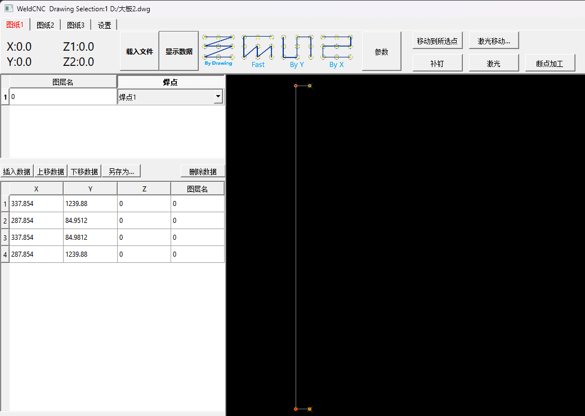

# English:
1. To update the program, simply download the WeldCNC folder. Run the program from the WeldCNC folder using WeldCNC.exe.
# 한국어:
1. 프로그램을 업데이트하려면 WeldCNC 폴더를 다운로드하십시오. WeldCNC 폴더 내의 WeldCNC.exe를 실행하십시오.
# 简体中文
1.更新程序，下载WeldCNC文件夹即可，程序运行WeldCNC文件夹里的WeldCNC.exe。

# Program Modification History
|No.|Time|Update|
|-|-|-|
|1|2023.9.19|Added welding count alarm to prompt gun head replacement|
|2|2024.6.27|2 drawings can be imported, the selection is in setting|
# 프로그램 수정 이력
|번호|시간|업데이트|
|-|-|-|
|1|2023.9.19|용접 횟수 알람 추가하여 총 머리 교체를 알림|
|2|2024.6.27|2개의 도면을 가져올 수 있으며, 선택은 설정에서 가능합니다|

# 程序修改记录
|序号|时间|更新内容|
|-|-|-|
|1|2023.9.19|新增了焊接次数报警，用于提示更换枪头|
|2|2024.6.27|可以使用两张图纸，在设置里|

# 设备操作说明

   - [第一章：快速上手](#第一章快速上手)
     - [1.1 准备工作](#11-准备工作)
     - [1.2 软件快速操作](#12-软件快速操作)
    
   ###
   - [第二章：软件参数](#第二章软件参数)
     - [2.1 dxf文件导入](#21-参数设置方法)
     - [2.2 控制卡参数](#21-参数设置方法)
     - [2.3 设备参数](#22-参数说明)
   ###
   - [第三章：设备参数](#第三章设备参数)
     - [3.1 电源接入要求](#31-电源接入要求)
     - [3.2 电气安全规范](#32-电气安全规范)
   ###
   - [第四章：常见故障](#第四章常见故障)
     - [4.1 常见错误](#41-常见错误)
   ###
   - [第五章：设备通信](#第五章设备通信)
     - [5.1 机器人接入](#51-机器人接入)
     - [5.2 ModbusTCP](#52-ModbusTCP)
     - [5.3 IO点位](#53-IOList)

### 

# Device instruction

  - [Chapter 1: Quick Start](#chapter-1-quick-start)
     - [1.1 Preparations](#11-preparations)
     - [1.2 Quick Software Operation](#12-quick-software-operation)
    
   ###
   - [Chapter 2: Software Parameters](#chapter-2-software-parameters)
     - [2.1 Importing dxf Files](#21-importing-dxf-files)
     - [2.2 Control Card Parameters](#22-control-card-parameters)
     - [2.3 Device Parameters](#23-device-parameters)
   ###
   - [Chapter 3: Device Parameters](#chapter-3-device-parameters)
     - [3.1 Power Connection Requirements](#31-power-connection-requirements)
     - [3.2 Electrical Safety Standards](#32-electrical-safety-standards)
###

- [Chapter 4: Common Failures](#chapter-4-common-failures)

  - [4.1 Common Errors](#41-common-errors)

###

- [Chapter 5: Device Communication](#chapter-5-device-communication)

  - [5.1 Robot Integration](#51-robot-integration)

  - [5.2 ModbusTCP](#52-modbustcp)

  - [5.3 IO Points](#53-io-list)

   
   # 第一章：快速上手
   ## 准备工作
   1.接入电源，设备使用220AC/50Hz的交流电以及压缩空气，请在开启设备前确认交流电和气泵。
   
   2.保证设备运行有足够的空间，供装卸工件。
   
   3.设备不应该在超过45度环境中工作。

   <b name="12-软件快速操作"></b>
   ## 软件快速操作
   1.当通电后，开启电脑，电脑进入桌面后，桌面有CADStart和WeldChart两个快捷方式，其中CADStart是设备操作，WeldChart是焊机的电压控制程序。

   
   2.点击软件主页的复位，设备伺服会进行找原点。

   3.复位完毕后，运行会显示为红色，点击一次，设备会跑到卸载点，这样可以放入工件到设备上。
   
   4.工件放入到设备上，再点击一次运行，设备就可以开始工作了。

###

   <c name="软件参数"></c>
   # 第二章:软件参数
   

   <c name="设备参数"></c>
   # 第三章:设备参数

   1.控制卡接口
   

  <c name="设备通信"></c>
  # 第五章:设备通信

<c name="Device Communication"></c>
# Chapter 5: Device Communication 

## 5.1机器人通信
设备通过modbus和IO点位分别和机器人通信，通信逻辑。
当设备上电后或报警后，需要进行复位，运行时序如下。
设备上电初始化逻辑
复位信号输入（gin3组10）-> 触发运行回卸载点(gin3组11)

当设备初始完毕后，运行逻辑如下
设备运行逻辑
给卸料完毕信号告诉设备没料(gin2组6) -> 等待准备上料信号(gout2组5， 设备需要复位完成且在卸载点且给卸料完毕信号才会输出) -> 触发运行回卸载点(gin3组11) -> 等待焊接完成信号(gout2组6) 
然后循环以上逻辑

## 5.1 Robot Communication
The device communicates with the robot through Modbus and IO points, each with its own communication logic.
When the device is powered on or in an alarm state, a reset is required. The operational sequence is as follows:
Device Power-On Initialization Logic
Reset signal input (gin3 group 10) -> Trigger running back to unload point (gin3 group 11)

Once the device initialization is complete, the operational logic is as follows:
Device Running Logic
Signal to indicate unloading is complete to inform the device of no material (gin2 group 6) -> Wait for signal to prepare for material loading (gout2 group 5, the device needs to complete the reset, be at the unload point, and receive the signal indicating unloading completion to output) -> Trigger running back to unload point (gin3 group 11) -> Wait for welding completion signal (gout2 group 6)
Then repeat the above logic.

## 5.2ModbusTCP 表
| 地址       | 程序偏移 | 长度 | 含义               |
|-----------|---------|-----|-------------------|
| 4x01      | 0       | 1   | 设备运行（1 运行中 0未运行） |
| 4x02      | 1       | 1   | 复位过？（1 复位过 0未复位）   |
| 4x03      | 2       | 2   | 焊接数量            |
| 4x05      | 4       | 2   | 焊接次数            |
| 4x07      | 6       | 1   | 焊接高度1(1005表示 100.5mm) |
| 4x09      | 8       | 1   | 焊接高度2            |
| 4x11      | 10      | 1   | 焊接高度3            |
| 4x13      | 12      | 1   | 焊接高度4            |
| 4x15      | 14      | 1   | 焊接高度5            |
| 4Xbit-1700| 16      | 1bit| 焊接中              |
| 4Xbit-1701| 16      | 1bit| 设备运行中           |
| 4Xbit-1702| 16      | 1bit| 复位完成信号          |
| 4Xbit-1703| 16      | 1bit| 卸载点信号（需要复位完成后才会触发）          |
| 4X21    | 20      | 1bit| 卸载点信号（需要复位完成后才会触发）          |

## 5.2ModbusTCP list
| Address    | Program Offset | Length | Meaning                            |
|------------|----------------|--------|------------------------------------|
| 4x01       | 0              | 1      | Device Running (1 for running, 0 for not running) |
| 4x02       | 1              | 1      | Reset Done? (1 for reset done, 0 for not reset) |
| 4x03       | 2              | 2      | Welding Quantity                   |
| 4x05       | 4              | 2      | Welding Count                      |
| 4x07       | 6              | 1      | Welding Height 1 (1005 represents 100.5mm) |
| 4x09       | 8              | 1      | Welding Height 2                   |
| 4x11       | 10             | 1      | Welding Height 3                   |
| 4x13       | 12             | 1      | Welding Height 4                   |
| 4x15       | 14             | 1      | Welding Height 5                   |
| 4Xbit-1700 | 16             | 1bit   | Welding In Progress                |
| 4Xbit-1701 | 16             | 1bit   | Device Running                     |
| 4Xbit-1702 | 16             | 1bit   | Origin Completion Signal            |
| 4Xbit-1703 | 16             | 1bit   | LoadPosition signal(Triggered after device origined)          |
| 4X21    | 20                | 1      | LoadPosition signal(Triggered after device origined)          |

## 5.3输入输出组

### gin1组
| 编号 | 功能 | 其他 | INO |
|------|------|------|-----|
| 0    | 下压1的上感应器（机型1 2） |      | INO_0 |
| 1    | 下压2的上感应器（机型1 2） |      | INO_1 |
| 2    | 下压3的上感应器（机型1 2） |      | INO_2 |
| 3    | 推钉1的后感应器（机型1）   |      | INO_3 |
| 4    | 推钉1的后感应器（机型2）   |      | INO_5 |
| 5    | 推钉3的后感应器（机型1）   |      | INO_6 |
| 6    | 推钉3的后感应器（机型2）   |      | INO_7 |
| 7    | 检测钉1是否有钉感应器      |      | INO_8 |
| 8    | 检测钉2是否有钉感应器      |      | INO_9 |
| 9    | 检测钉3是否有钉感应器      |      | INO_10 |
| 10   | 检测钉4是否有钉感应器      |      | INO_11 |
| 11   | 检测钉5是否有钉感应器      |      | INO_12 |
| 12   | 检测钉6是否有钉感应器      |      | INO_13 |
| 13   | -                          |      | INO_14 |
| 14   | -                          |      | INO_15 |
| 15   | 焊接负极气缸的上感应器     |      | INO_15 |

### gin2组
| 编号 | 功能 | 其他 | INO |
|------|------|------|-----|
| 0    | 机械臂已经取料信号         |      | INO_16 |
| 1    | -                          |      | INO_17 |
| 2    | -                          |      | INO_18 |
| 3    | -                          |      | INO_19 |
| 4    | -                          |      | INO_20 |
| 5    | 气压报警                   |      | INO_21 |
| 6    | 检测是否有料，用于机械臂检测是否取料完成（搬运下料完成） |      | INO_22 |
| 7    | -                          |      | INO_23 |

### gin3组
| 编号 | 功能 | 其他 | INO |
|------|------|------|-----|
| 0    | -                          |      | INO_28 |
| 1    | -                          |      | INO_29 |
| 2    | -                          |      | INO_30 |
| 3    | -                          |      | INO_31 |
| 4    | -                          |      | INI_0 |
| 5    | -                          |      | INI_1 |
| 6    | -                          |      | INI_2 |
| 7    | 暂停                       |      | INI_3 |
| 8    | 运行/非运行状态（给信号就开始焊接图纸2） |      | INI_4 |
| 9    | PLC启动信号（需要PLC的机器） |      | INI_5 |
| 10   | 回原点                     |      | INI_6 |
| 11   | 运行/非运行状态（给信号开始焊接图纸1）（急停，启动都是同一个） |      | INI_7 |

### AIO组
| 编号 | 功能 | 其他 | 
|------|------|------|
| 0+   | 可以不接 x轴正限位         |      |
| 0-   | x轴负限位（左边）          |      |
| 0O   | x轴原点                    |      |
| 1+   | Y轴正限位（机台后端）      |      |
| 1-   | Y轴负限位（机台前端）      |      |
| 1O   | Y轴原点                    |      |
| 2+   | 可以不接 Z1轴正限位        |      |
| 2-   | Z1轴负限位                 |      |
| 2O   | Z1轴原点                   |      |
| 3+   | 可以不接 Z2轴正限位        |      |
| 3-   | Z2轴负限位（如果有Z2）     |      |
| 3O   | Z2轴原点                   |      |
| 30   | 不接                       |      |

### gout1组
| 编号  | 功能 | IO No |
|--------|---------|---------|
| 0      | 压钉气缸1（机型2）压钉气缸1（机型1） | OUT1    |
| 1      | 压钉气缸2（机型2）压钉气缸2（机型1） | OUT2    |
| 2      | 压钉气缸3（机型2）压钉气缸3（机型1） | OUT3    |
| 3      | 推钉气缸1（机型2）推钉气缸1（机型1） | OUT4    |
| 4      | 推钉气缸2（机型2）推钉气缸2（机型1） | OUT5    |
| 5      | 推钉气缸3（机型2）推钉气缸3（机型1） | OUT6    |
| 6      | 真空1（机型1）                       | OUT7    |
| 7      | 真空2（机型2）                       | OUT8    |
| 8      |                                       | OUT9    |
| 9      | 要料信号1（机型1 2）                 | OUT10   |
| 10     | 要料信号2（机型1 2）                 | OUT11   |
| 11     | 要料信号3（机型1 2）                 | OUT12   |
| 12     | 要料信号4（机型1 2）                 | OUT13   |
| 13     | 要料信号5（机型1 2）                 | OUT14   |
| 14     | 焊接信号                             | OUT15   |
| 15     | 焊接负极气缸（机型2）图纸1焊接的时候就会启动（工作状态中，不包含回原点和卸载电） | OUT16   |

### gout2组
| 编号  | 功能 | IO No |
|--------|---------|---------|
| 0      | 压钉气缸4（机型1） | OUT17   |
| 1      | 压钉气缸4（机型1） | OUT18   |
| 2      | 压钉气缸4（机型1） | OUT19   |
| 3      | 压钉气缸4（机型1） | OUT20   |
| 4      | 激光（机型1）       | OUT21   |
| 5      | 运行信号，可以接收料状态，即要料信号（复位完成+空载）（上料准备就绪） | OUT22   |
| 6      | 运行信号，没接收完成，可以取料信号（给机器人焊接完成信号）（下料准备就绪） | OUT23   |
| 7      | 复位完成信号，如果复位过，则有信号输出，没复位过则不输出 | OUT24   |
| 8      |                                       | OUT25   |
| 9      | 转换气缸1 到1                         | OUT26   |
| 10     | 转换气缸 到2                          | OUT27   |
| 11     | 转换气缸 到3                          | OUT28   |
| 12     | 转换气缸 到4                          | OUT29   |
| 13     | 转换气缸 到5                          | OUT30   |
| 14     | 报警信号（报警）                      | OUT31   |

## Input Groups

### gin1 Group
| No. | Function | Others | INO |
|----|----------|--------|-----|
| 0  | Upper sensor of press 1 (Model 1, 2) | | INO_0 |
| 1  | Upper sensor of press 2 (Model 1, 2) | | INO_1 |
| 2  | Upper sensor of press 3 (Model 1, 2) | | INO_2 |
| 3  | Rear sensor of nail pusher 1 (Model 1) | | INO_3 |
| 4  | Rear sensor of nail pusher 1 (Model 2) | | INO_5 |
| 5  | Rear sensor of nail pusher 3 (Model 1) | | INO_6 |
| 6  | Rear sensor of nail pusher 3 (Model 2) | | INO_7 |
| 7  | Nail detection sensor 1 | | INO_8 |
| 8  | Nail detection sensor 2 | | INO_9 |
| 9  | Nail detection sensor 3 | | INO_10 |
| 10 | Nail detection sensor 4 | | INO_11 |
| 11 | Nail detection sensor 5 | | INO_12 |
| 12 | Nail detection sensor 6 | | INO_13 |
| 13 | - | | INO_14 |
| 14 | - | | INO_15 |
| 15 | Upper sensor of welding negative cylinder | | INO_15 |

### gin2 Group
| No. | Function | Others | INO |
|----|----------|--------|-----|
| 0  | Signal of robot arm picking up material | | INO_16 |
| 1  | - | | INO_17 |
| 2  | - | | INO_18 |
| 3  | - | | INO_19 |
| 4  | - | | INO_20 |
| 5  | Air pressure alarm | | INO_21 |
| 6  | Material detection for robot arm (completion of material handling) | | INO_22 |
| 7  | - | | INO_23 |

### gin3 Group
| No. | Function | Others | INO |
|----|----------|--------|-----|
| 0  | - | | INO_28 |
| 1  | - | | INO_29 |
| 2  | - | | INO_30 |
| 3  | - | | INO_31 |
| 4  | - | | INI_0 |
| 5  | - | | INI_1 |
| 6  | - | | INI_2 |
| 7  | Emergency stop | | INI_3 |
| 8  | Running/Not running status (starts welding drawing 2 when signaled) | | INI_4 |
| 9  | PLC start signal (for machines requiring PLC) | | INI_5 |
| 10 | Return to origin | | INI_6 |
| 11 | Running/Not running status (starts welding drawing 1 when signaled) (emergency stop and start are the same) | | INI_7 |

### AIO Group
| No. | Function | Others |
|----|----------|--------|
| 0+ | Can be unconnected, X-axis positive limit | |
| 0- | X-axis negative limit (left side) | |
| 0O | X-axis origin | |
| 1+ | Y-axis positive limit (rear end of machine) | |
| 1- | Y-axis negative limit (front end of machine) | |
| 1O | Y-axis origin | |
| 2+ | Can be unconnected, Z1-axis positive limit | |
| 2- | Z1-axis negative limit | |
| 2O | Z1-axis origin | |
| 3+ | Can be unconnected, Z2-axis positive limit | |
| 3- | Z2-axis negative limit (if Z2 exists) | |
| 3O | Z2-axis origin | |
| 30 | Unconnected | |

### gout1 Group
| No.  | Function | IO No. |
|------|----------|--------|
| 0    | Press Pin Cylinder 1 (Model 2) Press Pin Cylinder 1 (Model 1) | OUT1    |
| 1    | Press Pin Cylinder 2 (Model 2) Press Pin Cylinder 2 (Model 1) | OUT2    |
| 2    | Press Pin Cylinder 3 (Model 2) Press Pin Cylinder 3 (Model 1) | OUT3    |
| 3    | Push Pin Cylinder 1 (Model 2) Push Pin Cylinder 1 (Model 1)   | OUT4    |
| 4    | Push Pin Cylinder 2 (Model 2) Push Pin Cylinder 2 (Model 1)   | OUT5    |
| 5    | Push Pin Cylinder 3 (Model 2) Push Pin Cylinder 3 (Model 1)   | OUT6    |
| 6    | Vacuum 1 (Model 1)                                            | OUT7    |
| 7    | Vacuum 2 (Model 2)                                            | OUT8    |
| 8    |                                                              | OUT9    |
| 9    | Material Request Signal 1 (Model 1 & 2)                       | OUT10   |
| 10   | Material Request Signal 2 (Model 1 & 2)                       | OUT11   |
| 11   | Material Request Signal 3 (Model 1 & 2)                       | OUT12   |
| 12   | Material Request Signal 4 (Model 1 & 2)                       | OUT13   |
| 13   | Material Request Signal 5 (Model 1 & 2)                       | OUT14   |
| 14   | Welding Signal                                                | OUT15   |
| 15   | Welding Negative Cylinder (Model 2) Starts during welding (working state, excluding homing and unloading) | OUT16   |

### gout2 Group
| No.  | Function | IO No. |
|------|----------|--------|
| 0    | Press Pin Cylinder 4 (Model 1) | OUT17   |
| 1    | Press Pin Cylinder 4 (Model 1) | OUT18   |
| 2    | Press Pin Cylinder 4 (Model 1) | OUT19   |
| 3    | Press Pin Cylinder 4 (Model 1) | OUT20   |
| 4    | Laser (Model 1)                | OUT21   |
| 5    | Running Signal, can receive material status, i.e., material request signal (reset complete + no load) (loading ready) | OUT22   |
| 6    | Running Signal, not received complete, can take material signal (robot welding complete signal) (unloading ready) | OUT23   |
| 7    | Reset Complete Signal, if reset, there is signal output, if not reset, no output | OUT24   |
| 8    |                                | OUT25   |
| 9    | Switch Cylinder 1 to 1         | OUT26   |
| 10   | Switch Cylinder to 2           | OUT27   |
| 11   | Switch Cylinder to 3           | OUT28   |
| 12   | Switch Cylinder to 4           | OUT29   |
| 13   | Switch Cylinder to 5           | OUT30   |
| 14   | Alarm Signal (Alarm)           | OUT31   |